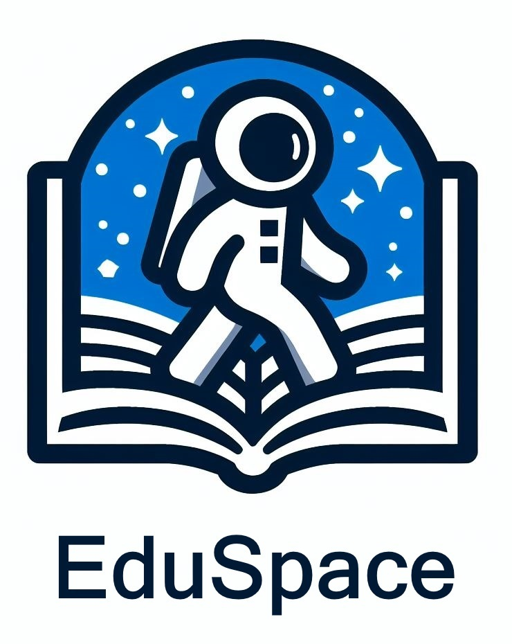

<div align="center">
    
</div>
<br/>

**EduSpace** is an e-learning platform built with Django. It provides a robust and interactive learning environment for users, offering a variety of online courses across multiple disciplines.

**Features**
---
- User Registration: Users can create their own accounts to access the courses.
- Course Catalog: A wide range of courses available for users to enroll in.
- Interactive Lessons: Each course is broken down into manageable lessons, complete with interactive content.
- Progress Tracking: Users can track their progress through each course.

**Installation**
---
1. Clone the repository:
    ```bash
    git clone https://github.com/mostafa-re/eduspace.git
    ```

2. Navigate to the project directory:
    ```bash
    cd eduspace
    ```

3. Install the requirements:
    ```bash
    pip install -r requirements.txt
    ```

4. Run the server:
    ```bash
    python manage.py runserver
    ```

Now, you can access the application on your local server.

**License**
---
This project is licensed under the [BSD 2-Clause License](LICENSE).
